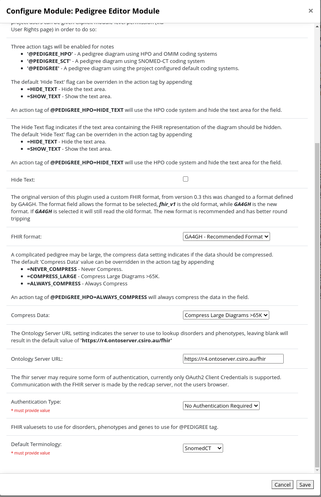
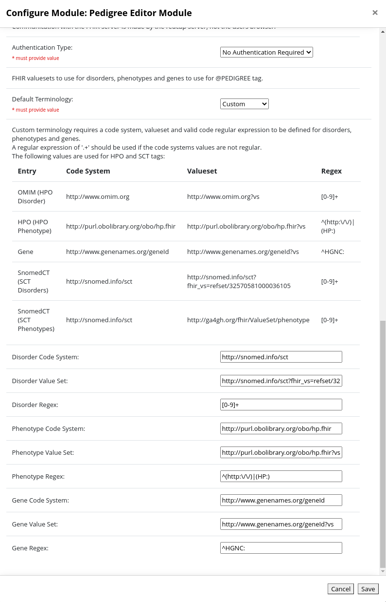
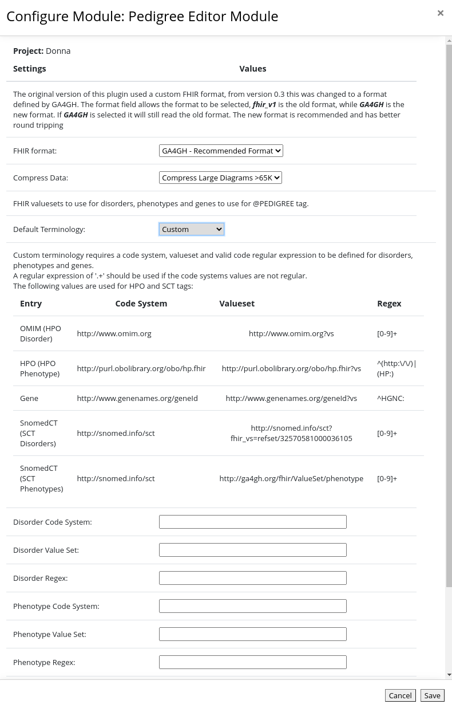
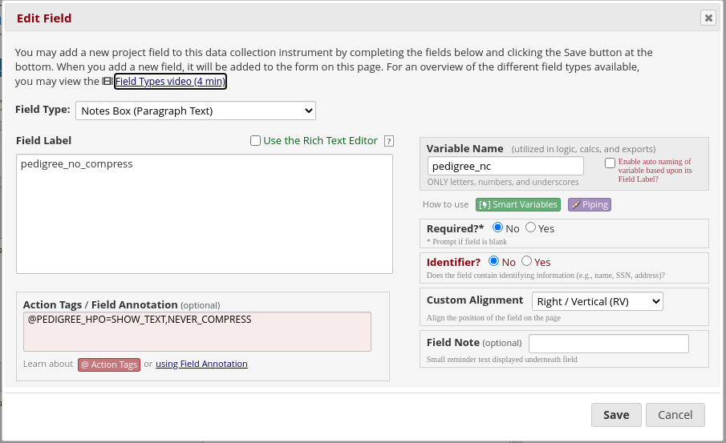
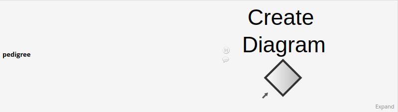
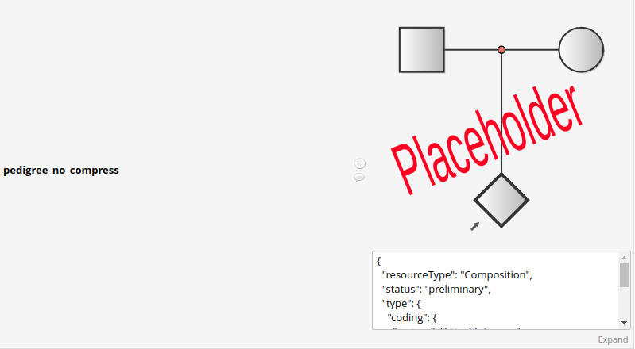

# Pedigree Editor External Module

The pedigree editor external module allows a notes field to be marked with an anotation to indicate the field will represent a pedigree diagram.

The module will then hide or disable the notes field and instead spawn a new window to allow the entry of the pedigree diagram. The diagram will then be serialised as a FHIR Composition JSON string and written into the notes field. 
The pedigree editor used is [https://github.com/aehrc/open-pedigree](https://github.com/aehrc/open-pedigree) which is an open version of the phenotips pedigree editor.
The plugin also makes use of [pako](https://github.com/nodeca/pako) a javascript implementation of the Zlib library.

This module will not function in internet explorer.

## Installing the module

To install first you need to retrieve the distribution. This can be found on the releases page [https://github.com/aehrc/redcap_pedigree_editor/releases](https://github.com/aehrc/redcap_pedigree_editor/releases) page or 
the official redcap repository [https://redcap.vanderbilt.edu/consortium/modules/](https://redcap.vanderbilt.edu/consortium/modules/)

Alternatively you can clone the git repository and generate your own distribution file. To do this, clone the git repository into a working directory, then use the git archive command to build a release.
```
git clone https://github.com/aehrc/redcap_pedigree_editor.git
cd redcap_pedigree_editor
git archive --format=zip  --prefix=redcap_pedigree_editor_v0.3.2/ -o ../redcap_pedigree_editor_v0.3.2.zip HEAD
```

This will give you a file redcap_pedigree_editor_v0.3.zip

## Changes
- v0.1 - Initial Release 
- v0.1.1 - Allow use inside a survey
- v0.2 - Upgrade open-pedigree version to allow use of the svg image encoded in the pedigree data to show real 
representation of the diagram, add compression for large diagrams.
- v0.3 - Change to use the new GA4GH FHIR format, do terminology lookups via a web service hosted in redcap.
- v0.3.1 - Minor bug fix in open-pedigree
- v0.3.2 - Add new action tag **@PEDIGREE** which uses configurable terminology settings.

# Install the distribution

The distribution is installed by unzipping the distribution file into the `redcap/modules/` directory of the redcap installation.

This should result in the new directory `'redcap_pedigree_editor_v0.3.2'`. The external module directory name must meet a strict naming
convention, if the directory is missing the `'v'` before the version number then the module won't be picked up by redcap, so rename
the directory to match the form `'<module name>_v<version number>'`.

If everything has gone to plan the module should now appear in the list of available modules that can be enabled.

## Configuring the module

Once installed the module has a number of system wide options:

 - *Hide Text* - Flag to indicate if the text area associated with the note should be shown. The format used to store 
   diagram will likely not make sense to anyone so this option should probably set to true.
 - *FHIR Format* - Allows the selection of which FHIR format to use. This is to allow the legacy FHIR format used for 
   version prior to v0.3 to continue to be used. The GA4GH format is recommended. This is the system wide
   setting, there is also a project level FHIR format setting which can be used to override this.
 - *Compress Data* - Specifies how to deal with large diagrams. The fhir format returned from the open_pedigree editor 
   will now have a new section called 'Pedigree Diagram' which will contain a DocumentReference which will have an SVG 
   representation of the pedigree diagram. This diagram will be used by the redcap plugin to show the pedigree diagram. 
   Because there are size limitations for the text in the redcap database associated with the pedigree field the 
   addition of the 'Pedigree Diagram' section can quite easilly exceed the limit. The 'Compress Data' options tells the
   system how to deal with the returned text exceeding 64K. The options are:
   - *Never Compress* - (this is the default) Compression is not used. If the data exceeds 65K characters the diagram will
     be stripped from the result and any future views of the diagram inside redcap will instead show a placeholder image.
   - *Compress Large Diagrams >65K* - The data is compressed if its over 65K. If its still too large after being 
     compressed, the diagram is stripped and the if its greater than 65K its compressed.
   - *Always Compress* - The data is always compressed. If the compressed data is greater than 65K the diagram is stripped.
 - *Ontology Server URL* - The URL for FHIR ontology server used to lookup disorders, phenotypes and genes.
 - *Authentication Type* - The authentication to use when communicating with the FHIR server. This can be either `none`
      or `OAuth2 Client Credentials`. The client credentials flow uses a client id and secret to obtain an access token.
   - *OAuth2 token endpoint*  - The token endpoint used to obtain the access token. This is required for `Oauth2 Client Credentials` authentication type.
   - *Client Id* - The client id to use to fetch an access token. This is required for `Oauth2 Client Credentials` authentication type.
   - *Client Secret* - The client secret to use to fetch an access token. This is required for `Oauth2 Client Credentials` authentication type.
 - *Default Terminology* - This setting configures the system level default terminologies to use with the @PEDIGREE tag. It will be one of:
   - *SNOMEDCT* - This uses the same terminology as the @PEDIGREE_SCT tag.
   - *HPO* - This uses the same terminology as the @PEDIGREE_HPO tag.
   - *Custom* - The terminology settings will be entered into additional fields.
     - *Disorder Code System* - The FHIR code system to use for disorders.
     - *Disorder Valueset* - The FHIR valueset to use for disorders.
     - *Disorder Regex* - Regular expression used to test if a code could be a member of the phenotype code system.
     - *Phenotype Code System* - The FHIR code system to use for phenotypes.
     - *Phenotype Valueset* - The FHIR valueset to use for phenotypes.
     - *Phenotype Regex* - Regular expression used to test if a code could be a member of the phenotype code system.
     - *Gene Code System* - The FHIR code system to use for genes.
     - *Gene Valueset* - The FHIR valueset to use for genes.
     - *Gene Regex* - Regular expression used to test if a code could be a member of the gene code system.




### Project Settings

Each project can override the *FHIR Format* and *Compress Data* setting. If left blank then the system setting will be used.
The project can also override the terminology to use with the @PEDIGREE action tag
- *Default Terminology* - This setting configures the system level default terminologies to use with the @PEDIGREE tag. It will be one of:
    - *SNOMEDCT* - This uses the same terminology as the @PEDIGREE_SCT tag.
    - *HPO* - This uses the same terminology as the @PEDIGREE_HPO tag.
    - *System* - This uses the system default terminology settings.
    - *Custom* - The terminology settings will be entered into additional fields.
        - *Disorder Code System* - The FHIR code system to use for disorders.
        - *Disorder Valueset* - The FHIR valueset to use for disorders.
        - *Disorder Regex* - Regular expression used to test if a code could be a member of the phenotype code system.
        - *Phenotype Code System* - The FHIR code system to use for phenotypes.
        - *Phenotype Valueset* - The FHIR valueset to use for phenotypes.
        - *Phenotype Regex* - Regular expression used to test if a code could be a member of the phenotype code system.
        - *Gene Code System* - The FHIR code system to use for genes.
        - *Gene Valueset* - The FHIR valueset to use for genes.
        - *Gene Regex* - Regular expression used to test if a code could be a member of the gene code system.




## Creating a Pedigree field
To make use of the editor a field needs to be created in the online designer and marked with one of two action tags. Only fields of type `Notes Box` are considered.
  - *@PEDIGREE_HPO* - Marks a field to be a pedigree editor using the HPO and OMIM coding systems for phenotypes and disorders.
  - *@PEDIGREE_SCT* - Marks a field to be a pedigree editor using the SNOMED-CT coding system for phenotypes and disorders.
  - *@PEDIGREE* - Marks a field to be a pedigree editor using the default coding system for phenotypes and disorders (new to version 0.3.2).

The default 'Hide Text' and 'Compress Data' options can be overriden in the action tag by appending '=' plus a comma 
separated list of options.
  - *HIDE_TEXT* - Hide the text area.
  - *SHOW_TEXT* - Show the text area.
  - *NEVER_COMPRESS* - Never compress the data stored in this field.
  - *COMPRESS_LARGE* - Compress the data if it exceeds 65K characters.
  - *ALWAYS_COMPRESS* - Always compress the data for this field.

An action tag of @PEDIGREE_HPO=HIDE_TEXT,NEVER_COMPRESS will use the HPO code system and hide the text area for the 
field and prevent compression of the data stored in the field.




## Data Entry

In the data entry page, a notes field marked with the pedigree editor action tag will show a large image, if this is clicked 
a new window will open and allow the pedigree diagram to be editted. 
An empty field will appear as the words 'Create Diagram' with a single diamond.
A field for which a diagram has been added will show the image for the diagram extracted from the data returned from the 
editor. If this has been stripped for some reason instead a placeholder image is shown.
 




If the pedigree data does not contain an image a placeholder image is shown.




# Upgrade Issues

Version 0.3 of this plugin stores data using the fhir format developed by GA4GH (Global Alliance for Genomics and Health).
Information on the proposed format can be found https://github.com/GA4GH-Pedigree-Standard/pedigree-fhir-ig
This is a different format to ealier version of the plugin.

Versions of the module before v0.3 use a different FHIR based representation. The open-pedigree editor can read both formats,
the old format is referred to as `Legacy FHIR` in the editor. If you have an existing project and wish to
move existing pedigree diagrams to use the new format, it will be necessary to open the diagrams in the editor and resave
the diagram to move it into the new format.

The open-pedigree editor has three different lookups which are queried from a FHIR terminology server.
These are in the clinical tab of a person and are disorders, genes and phenotypic features. For versions
before v0.3, these lookups are made from web browser to the FHIR terminology server. In v0.3 this was
changed to go via redcap. This change was made to allow the use of a terminology server which requires
authentication. Along with this change, the default Fhir server changed from 
`https://genomics.ontoserver.csiro.au/fhir` to `https://r4.ontoserver.csiro.au/fhir`. This also meant
some changes in the FHIR valuesets used. This may mean that opening a previously saved diagram may have
problems reloading the disorder, genes and phenotypic features fields.

## Terminology Changes

|Field               |<v0.3 Value                                            | v0.3 Value                                            |
|--------------------|-------------------------------------------------------|-------------------------------------------------------|
| HPO                                                                                                                                |
|Disorder CodeSystem |http://www.omim.org                                    |http://www.omim.org                                    |
|Disorder ValueSet   |http://www.omim.org                                    |http://www.omim.org?vs                                 |
|Gene CodeSystem     |http://www.genenames.org                               |http://www.genenames.org/geneId                        |
|Gene ValueSet       |http://www.genenames.org                               |http://www.genenames.org/geneId?vs                     |
|Phenotype CodeSystem|http://purl.obolibrary.org/obo/hp.owl                  |http://purl.obolibrary.org/obo/hp.fhir                 |
|Phenotype ValueSet  |http://purl.obolibrary.org/obo/hp.owl?vs               |http://purl.obolibrary.org/obo/hp.fhir?vs              |
| SCT                                                                                                                                |
|Disorder CodeSystem |http://snomed.info/sct                                 |http://snomed.info/sct                                 |
|Disorder ValueSet   |http://snomed.info/sct?fhir_vs=refset/32570581000036105|http://snomed.info/sct?fhir_vs=refset/32570581000036105|
|Gene CodeSystem     |http://www.genenames.org                               |http://www.genenames.org/geneId                        |
|Gene ValueSet       |http://www.genenames.org                               |http://www.genenames.org/geneId?vs                     |
|Phenotype CodeSystem|http://snomed.info/sct                                 |http://snomed.info/sct                                 |
|Phenotype ValueSet  |http://ga4gh.org/fhir/ValueSet/phenotype               |http://ga4gh.org/fhir/ValueSet/phenotype               |
|--------------------|-------------------------------------------------------|-------------------------------------------------------|

In version 0.3.2 a new action tag **@PEDIGREE** was added, this will use the terminology configured as the default terminology.
The default terminology may be a custom set of terminology bindings.

# Large Data Issues
A redcap notes field can store up to 65K of character data. This should be fine if someone was typing a note, but with
adding an svg representation of the pedigree diagram as well as the verbose nature of FHIR a large diagram can hit this
limit. The compress data option will tell the plugin how to handle large data.  
Compressed data will be gzipped, converted to base64 and have 'GZ:' appended to the start of the text.

# GA4GH FHIR Formation Limitations
There is a slight disconnect between the data that can be entered into the open-pedigree editor and what
is stored in the GA4GH FHIR format. The editor allows for the entry of a multi-person node, which represents multiple
offspring. In the GA4GH format these will be represented as a single individual and the count will be lost.


# Legacy FHIR Formation Limitations
Unfortunately the legacy FHIR format specification does not map all the data field in the open-pedigree editor into the
format. Additionally some aspects of the mapping do not translate directly, where possible
naming conventions are used to try and account for these. For example the FHIR FamilyHistory resource has a single
name field which is a string. The pedigree editor has a first name, last name and a last name at birth, this will
be written into the FamilyHistory resource as <first name> <last name> (<last name at birth>). When importing the FHIR
resource everything but the last word is the first name a trailing '(name)' will be taken as last name at birth.

Heredity options - This can be 'Childless' or 'Infertile' in the editor, but is not currently stored on the fhir resource.
Carrier Status - This can be 'Carrier' or 'Pre-symptomatic' in the editor, but is not currently stored on the fhir resource.
Evaluated - This is a checkbox in the editor, but is not currently stored on the fhir resource.
Lost Contact - This is a checkbox in the editor, but is not currently stored on the fhir resource. 
Multiple Sibling Nodes - In the editor you can create a single node to represent multiple siblings, at the moment these
will be saved as a single familiy history resource with no name and the number of siblings will be lost.

Phenotype and Candidate Genes are both stored as Observation Resources associated with a family history resource. The
system uses a naming convention to distinguish the two, otherwise it tries to match the code system to try and determine
if the observation represents a Phenotype or Candidate gene.

Life status - This can be 'unborn', 'stillborn' and 'aborted' with an associated gestation age. This will be written into
the deceasedString field on the family history resource in a form like 'stillborn 34 weeks'.

#Legacy FHIR format

This is a breakdown of how the legacy FHIR format used in version of the plugin before v0.3.

The FHIR format uses a Composition as a container for the data.
https://www.hl7.org/fhir/composition.html


The composition contains 2-3 sections:
- Patient Condition - Contains information on the proband
- Family History - Contains information on family members
- Pedigree Diagram (may not be present) - If present will contain the pedigree diagram

The base composition will look like:
```json
{
  "resourceType" : "Composition", 
  "status" : "preliminary", 
  "type" : {
      "coding" : {
        "system" : "http://loinc.org", 
        "code" : "11488-4",
        "display" : "Consult note"
      }
    }, 
  "subject" : {
      "type": "Patient",
      "reference": "#pat"
    },
  "date" : "2019-11-11T11:44:25-10:00",
  "title" : "Pedigree Details",	  
  "section" : [
          {
            "title": "Patient Condition",
            "entry": [
              {
                "type": "Condition",
                "reference": "#cond_0"
              },
              {
                "type": "Observation",
                "reference": "#fmh_clinical_0_0"
              }
            ]
          },
          {
            "title": "Family History",
            "code": {
              "coding": {
                "system": "http://loinc.org",
                "code": "10157-6",
                "display": "History of family member diseases"
              }
            },
            "entry": [
              {
                "type": "FamilyMemberHistory",
                "reference": "#FMH_0"
              },
              {
                "type": "FamilyMemberHistory",
                "reference": "#FMH_1"
              },
              {
                "type": "FamilyMemberHistory",
                "reference": "#FMH_2"
              }
            ]
          },
          {
            "title" : "Pedigree Diagram",
            "entry" : [{
              "type" : "DocumentReference",
              "reference" : "#pedigreeImage"
            }]
          }
        ], 
  "contained" : [
          //the resources
  ]
}
```

Within the pedigree editor each node contains the following data.
- parents - parent nodes - Are encoded in the fmh resource using an extension.
- partners - nodes who are/were a partner of the person
- twins - siblings associated with same birth
- monozygotic - a flag to indicate twin type
- disorders - Set of disorders associated with the person
- hpo terms - Set of phenotypes associated with the person
- candidate genes - Set of genes associated with the person
- carrier status - flag to indicate if the person is a carrier of the disorder
- childless status - flag to indicate if the person is childless
- Last name
- First name
- Last name at birth
- gender
- Date of Birth
- Date of Death
- life status - This can be 'unborn', 'stillborn' and 'aborted'.
- gestation age - Used with life status to indicate gestation age for the status
- comments
- external ID

Each node is converted into a Family Member History resource, including the proband.
https://www.hl7.org/FHIR/familymemberhistory.html

Three different extensions are used to add data to the family member history resource
- http://hl7.org/fhir/StructureDefinition/family-member-history-genetics-parent - This extension is used to
  indicate the family members whom are the direct parents of this family member. The standard relationship field
  in family member history is how the person is related to the patient, not how other family members relate to
  each other.
- http://hl7.org/fhir/StructureDefinition/family-member-history-genetics-sibling - This extension is used to
  indicate the family member who is a sibling of this family member. This is used primarily to indicate twins or
  similar same birth siblings.
- http://hl7.org/fhir/StructureDefinition/family-member-history-genetics-observation - Links an observation
  resource to this family member. Normally in FHIR observations relate to the patient.

Disorders are encoded as a condition in the family member history record, which is not a separate resource. The
probands disorders will also have an associated Condition resource added (in the Patient Condition section).

Phenotypes and Genes are encoded as Observation resources.

Here is an example family member history resource
```json
{
      "resourceType": "FamilyMemberHistory",
      "id": "FMH_0",
      "status": "completed",
      "patient": {
        "type": "Patient",
        "reference": "#pat"
      },
      "name": "Jane Smith (Cooper)",
      "sex": {
        "coding": [
          {
            "system": "http://hl7.org/fhir/administrative-gender",
            "code": "female",
            "display": "Female"
          }
        ]
      },
      "relationship": {
        "coding": [
          {
            "system": "http://terminology.hl7.org/CodeSystem/v3-RoleCode",
            "code": "ONESELF",
            "display": "self"
          }
        ]
      },
      "extension": [
        {
          "url": "http://hl7.org/fhir/StructureDefinition/family-member-history-genetics-parent",
          "extension": [
            {
              "url": "type",
              "valueCodeableConcept": {
                "coding": [
                  {
                    "system": "http://terminology.hl7.org/CodeSystem/v3-RoleCode",
                    "code": "NMTH",
                    "display": "natural mother"
                  }
                ]
              }
            },
            {
              "url": "reference",
              "valueReference": {
                "reference": "#FMH_1"
              }
            }
          ]
        },
        {
          "url": "http://hl7.org/fhir/StructureDefinition/family-member-history-genetics-parent",
          "extension": [
            {
              "url": "type",
              "valueCodeableConcept": {
                "coding": [
                  {
                    "system": "http://terminology.hl7.org/CodeSystem/v3-RoleCode",
                    "code": "NFTH",
                    "display": "natural father"
                  }
                ]
              }
            },
            {
              "url": "reference",
              "valueReference": {
                "reference": "#FMH_2"
              }
            }
          ]
        },
        {
          "url": "http://hl7.org/fhir/StructureDefinition/family-member-history-genetics-observation",
          "valueReference": {
            "type": "Observation",
            "reference": "#fmh_clinical_0_0"
          }
        }
      ],
      "bornDate": "1970-02-10",
      "note": [
        {
          "text": "This is the comment"
        }
      ],
      "condition": [
        {
          "code": {
            "coding": [
              {
                "system": "http://snomed.info/sct",
                "code": "59494005",
                "display": "Congenital septal defect of heart"
              }
            ]
          }
        }
      ]
    }
```
