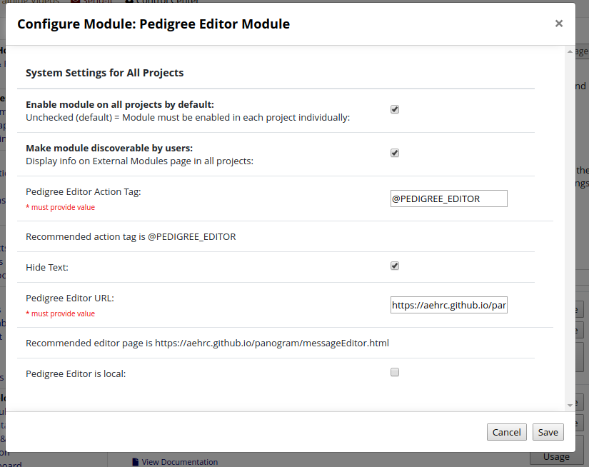
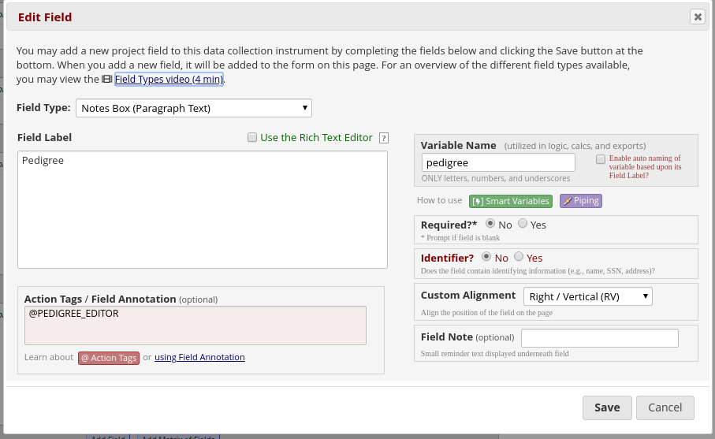
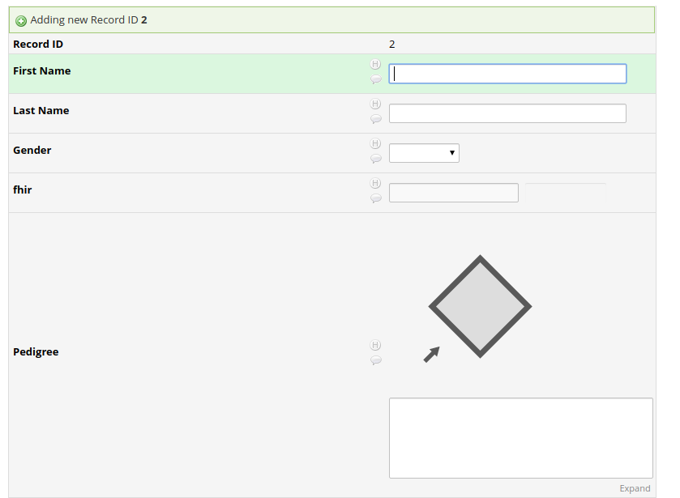
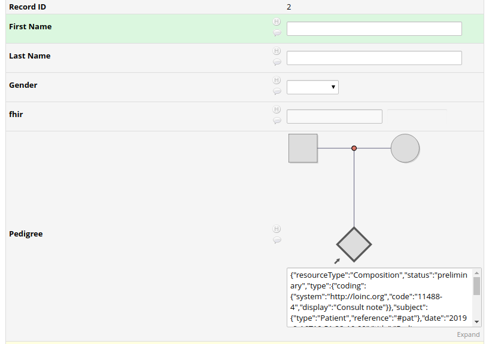

# Pedigree Editor External Module

The pedigree editor external module allows a notes field to be marked with an anotation to indicate the field will represent a pedigree diagram.

The module will then hide or disable the notes field and instead spawn a new window to allow the entry of the pedigree diagram. The diagram will then be serialised as a FHIR Composition JSON string and written into the notes field. The pedigree editor used is [https://github.com/aehrc/panogram](https://github.com/aehrc/panogram) which is an early version of the phenotips pedigree editor.

## Configuring the module

Once installed the module has a number of system wide options:

 - *Pedigree Editor Action Tag* - This is the action tag the external module should use to recognise which fields to apply to. This should be set to `@PEDIGREE_EDITOR`
 - *Hide Text* - Flag to indicate if the text area associated with the note should be shown. The format used to store diagram will likely not make sense to anyone so this option should probably set to true.
 - *Pedigree Editor URL* - The URL for the pedigree editor. This is the url that the module will open in a new window to edit the pedigree diagram. The *recommended* value is `https://aehrc.github.io/panogram/messageEditor.html`
 - *Pedigree Editor is local* - This flag is used to indicate that the url is internal to the external module. If there are firewall issues with reaching the recommended url, the panogram editor can be included into the external module and this flag set to true. In this case the url should be set to `panogram-master/messageEditor.html`

 

## Creating a Pedigree field
To make use of the editor a field needs to be created in the online designer and marked with the corresponding action tag. Only fields of type `Notes Box` are considered.

## Data Entry

In the data entry page, fields marked with the pedigree editor action tag will show a large image, if this is clicked a new window will open and allow the pedigree diagram to be editted. An empty field will appear as a single diamond, which an entry with some data will show a three element tree.

## Running a local editor
The recommended editor url is at a third party site, this may be unacceptable due to firewalls or other issues. The module also allows for the editor page to be contained within the module. To do this visit the editors github page and download a zip of the editor.

[https://github.com/aehrc/panogram/archive/master.zip](https://github.com/aehrc/panogram/archive/master.zip)

This zip is then extracted into the pedigree external module directory. This wil result in a directory panogram-master with all the files required by the editor. The module then needs to configured to have a url of `panogram-master/messageEditor.html` and have the `Pedigree Editor is local` checkbox selected.

## Message Protocol
Strictly speaking, this module does not understand the format of the pedigree editor. It just knows to open a url in a new browser window and to send the contents of the notes box via a window.postMessage() function, and to listen for message events and update the contents with data in the message. Below is the basic protocol the module uses.

1. Register for message events
2. Open url in window.
3. Wait for a message from the window with the contents `{ "messageType" : "panogram_control", "message": "started"}` this tells the module the page is loaded and can be sent the data to display
4. Send a message to the window with the contents

        { "messageType" : "panogram", 
          "panogramData" : { 
               "context": { "field" : <redcap field name> }, 
               "data" : <redcap field data> } 
          } 
        }
5. Wait for a message from the editor window with the same contents as step 4, but with updated data.

The module uses the contexts field to work out which field needs to be updated. If the instrument has more than one pedigree field this is how the module knows which to update. The module will also send a blank data message when the data entry page is left, this is incase the editor window is not closed. The editor should close when the save button is pressed, but the user can always navigate between the windows manually.

			