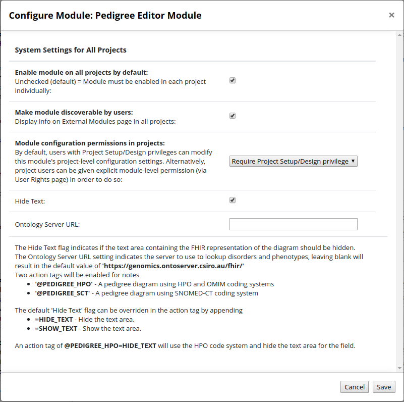
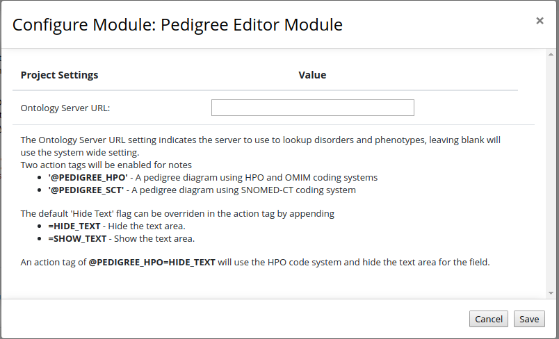
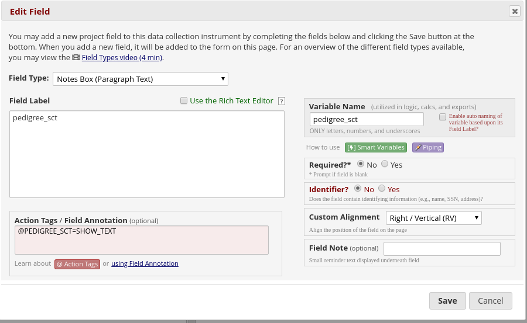

# Pedigree Editor External Module

The pedigree editor external module allows a notes field to be marked with an anotation to indicate the field will represent a pedigree diagram.

The module will then hide or disable the notes field and instead spawn a new window to allow the entry of the pedigree diagram. The diagram will then be serialised as a FHIR Composition JSON string and written into the notes field. The pedigree editor used is [https://github.com/aehrc/panogram](https://github.com/aehrc/panogram) which is an early version of the phenotips pedigree editor.

## Configuring the module

Once installed the module has a number of system wide options:

 - *Hide Text* - Flag to indicate if the text area associated with the note should be shown. The format used to store diagram will likely not make sense to anyone so this option should probably set to true.
 - *Ontology Server URL* - The URL for FHIR ontology server used to lookup disorders, phenotypes and genes. If left blank then the default *'https://genomics.ontoserver.csiro.au/fhir/'* will be used. There is a matching project setting, which allows a project to use a different ontology server.
 

### Project Settings

Each project can override the *Ontology Server URL* setting. If left blank then the system setting will be used.

## Creating a Pedigree field
To make use of the editor a field needs to be created in the online designer and marked with one of two action tags. Only fields of type `Notes Box` are considered.
  - *@PEDIGREE_HPO* - Marks a field to be a pedigree editor using the HPO and OMIM coding systems for phenotypes and disorders.
  - *@PEDIGREE_SCT* - Marks a field to be a pedigree editor using the SNOMED-CT coding system for phenotypes and disorders.

The default 'Hide Text' flag can be overriden in the action tag by appending
  - *=HIDE_TEXT* - Hide the text area.
  - *=SHOW_TEXT* - Show the text area.

An action tag of @PEDIGREE_HPO=HIDE_TEXT will use the HPO code system and hide the text area for the field.

## Data Entry

In the data entry page, fields marked with the pedigree editor action tag will show a large image, if this is clicked a new window will open and allow the pedigree diagram to be editted. An empty field will appear as a single diamond, which an entry with some data will show a three element tree.

			