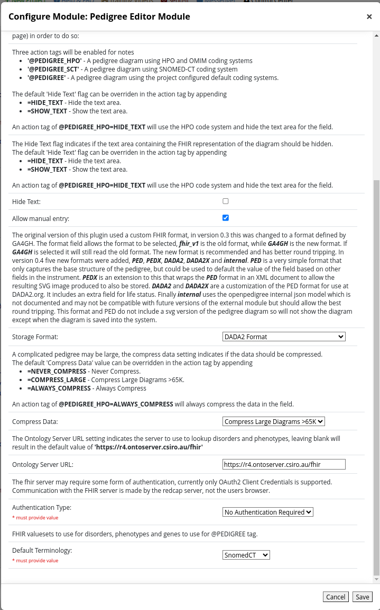
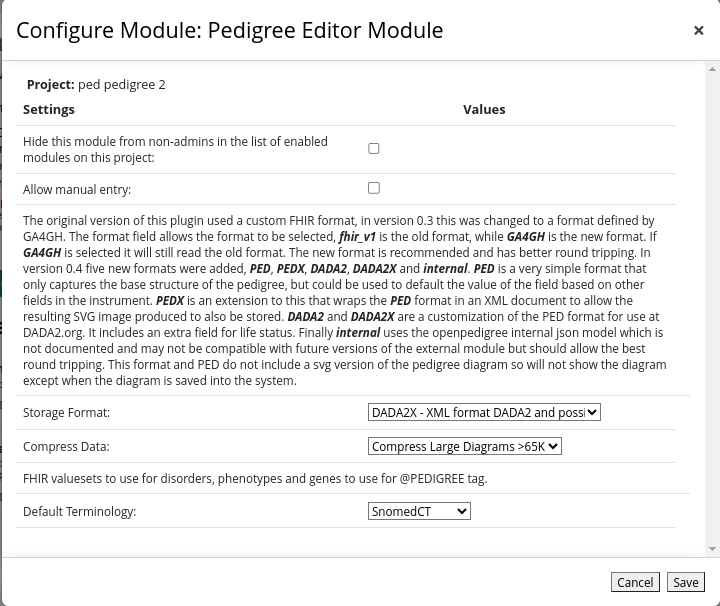
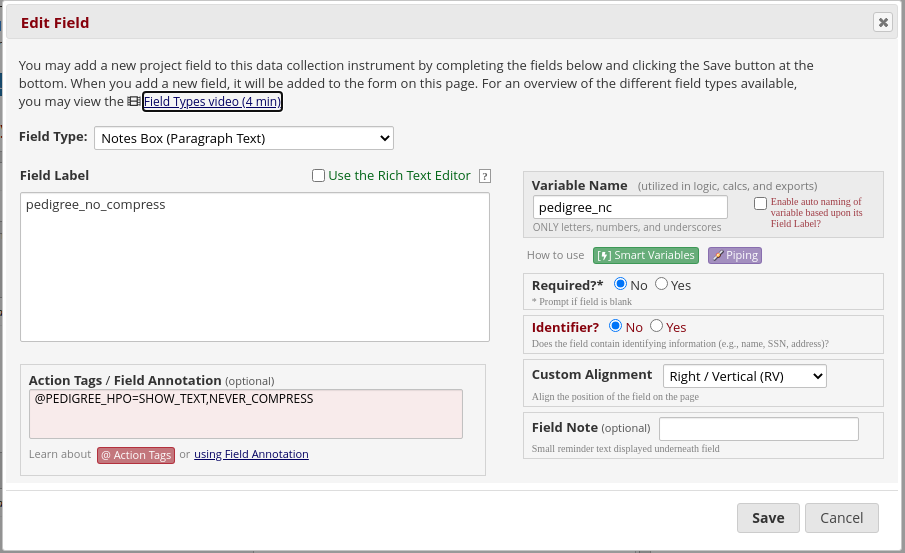
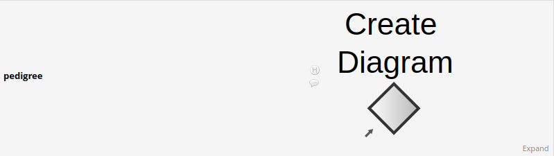
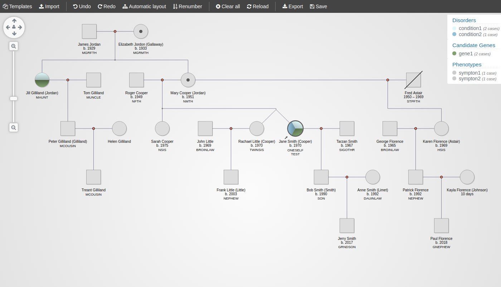
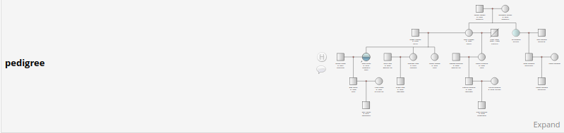
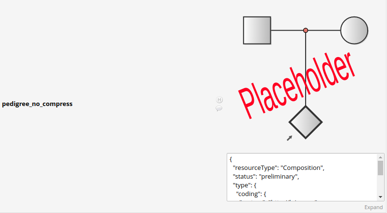

# Pedigree Editor External Module

The pedigree editor external module allows a notes field to be marked with an annotation to indicate the field will represent a pedigree diagram.

The module will then hide or disable the notes field and instead spawn a new window to allow the entry of the pedigree diagram. The diagram will then be serialised as a FHIR Composition JSON string and written into the notes field. 
The pedigree editor used is based on [https://github.com/aehrc/open-pedigree](https://github.com/aehrc/open-pedigree) which is an open version of the phenotips pedigree editor.
The [develop_redcap_em](https://github.com/aehrc/open-pedigree/tree/develop_redcap_em) branch of this codebase is included in the module.
The plugin also makes use of [pako](https://github.com/nodeca/pako) a javascript implementation of the Zlib library.

This module will not function in Internet Explorer.

## Installing the module

To install first you need to retrieve the distribution. This can be found on the releases page [https://github.com/aehrc/redcap_pedigree_editor/releases](https://github.com/aehrc/redcap_pedigree_editor/releases) page or 
the official redcap repository [https://redcap.vanderbilt.edu/consortium/modules/](https://redcap.vanderbilt.edu/consortium/modules/)

Alternatively you can clone the git repository and generate your own distribution file. To do this, clone the git repository into a working directory, then use the git archive command to build a release.
```
git clone https://github.com/aehrc/redcap_pedigree_editor.git
cd redcap_pedigree_editor
git archive --format=zip  --prefix=redcap_pedigree_editor_v0.5/ -o ../redcap_pedigree_editor_v0.5.zip HEAD
```

This will give you a file redcap_pedigree_editor_v0.5.zip

## Changes
- v0.1 - Initial Release 
- v0.1.1 - Allow use inside a survey
- v0.2 - Upgrade open-pedigree version to allow use of the svg image encoded in the pedigree data to show real 
representation of the diagram, add compression for large diagrams.
- v0.3 - Change to use the new GA4GH FHIR format, do terminology lookups via a web service hosted in redcap.
- v0.3.1 - Minor bug fix in open-pedigree
- v0.3.2 - Add new action tag **@PEDIGREE** which uses configurable terminology settings.
- v0.4 - Add support for PED and DADA2 formats.
- v0.5 - Bug fix in open-pedigree, change default fhir server and valuesets to use https://tx.ontoserver.csiro.au/fhir
- v0.6 - Add the ability to link pedigree nodes to rows of a repeating instrument and import their data, via the new
  **@PEDIGREE_FIELD** action tag and *Repeating instrument*/*Search fields*/*Node-edit form source* project settings —
  see [Linking Pedigree Nodes to a Repeating Instrument](#linking-pedigree-nodes-to-a-repeating-instrument).
  **Breaking**: remove the **@PEDIGREE_HPO**/**@PEDIGREE_SCT** action tags. Terminology is now always taken from
  the project/system *Default Terminology* setting — existing fields tagged **@PEDIGREE_HPO**/**@PEDIGREE_SCT** will stop
  being recognised as pedigree fields; update them to a bare **@PEDIGREE** tag and set *Default Terminology* accordingly.

# Install the distribution

The distribution is installed by unzipping the distribution file into the `redcap/modules/` directory of the redcap installation.

This should result in the new directory `'redcap_pedigree_editor_v0.4'`. The external module directory name must meet a strict naming
convention, if the directory is missing the `'v'` before the version number then the module won't be picked up by redcap, so rename
the directory to match the form `'<module name>_v<version number>'`.

If everything has gone to plan the module should now appear in the list of available modules that can be enabled.

## Configuring the module

Once installed the module has a number of system-wide options:

 - *Hide Text* - Flag to indicate if the text area associated with the note should be shown. The format used to store 
   diagram will likely not make sense to anyone so this option should probably set to true.
 - *Allow Manual Entry* - Normal if the text area is shown it is made readonly to prevent accidental entry. This option
   allow manual entry into the field (it is recommended not to enable this).
 - *Storage Format* - Allows the selection of which Storage format to use. This is to allow the legacy FHIR format used for 
   version prior to v0.3 to continue to be used. The GA4GH format is recommended. In version 0.4 five new formats were 
   added, ***PED***, ***PEDX***, ***DADA2***, ***DADA2X*** and ***internal***. ***PED*** is a very simple format that 
   only captures the base structure of the pedigree, it was added to allow piping to construct a basic pedigree. 
   ***PEDX*** is an extension to this that wraps the ***PED*** format in an XML document to allow the resulting SVG image
   produced to also be stored. ***DADA2*** and ***DADA2X*** are a customization of the PED format for use at DADA2.org. 
   It includes an extra field for life status. Finally, ***internal*** uses the openpedigree internal json model which 
   is not documented and may not be compatible with future versions of the external module but should allow the best 
   round tripping. This format, PED and DADA2 do not include a svg version of the pedigree diagram so will not show the
   diagram except when the diagram is saved into the system. This is the system-wide setting, there is also a project 
   level storage format setting which can be used to override this.
 - *Compress Data* - Specifies how to deal with large diagrams. The fhir format returned from the open_pedigree editor 
   will now have a new section called 'Pedigree Diagram' which will contain a DocumentReference which will have an SVG 
   representation of the pedigree diagram. This diagram will be used by the redcap plugin to show the pedigree diagram. 
   Because there are size limitations for the text in the redcap database associated with the pedigree field the 
   addition of the 'Pedigree Diagram' section can quite easily exceed the limit. The 'Compress Data' options tells the
   system how to deal with the returned text exceeding 64K. The options are:
   - *Never Compress* - (this is the default) Compression is not used. If the data exceeds 65K characters the diagram will
     be stripped from the result and any future views of the diagram inside redcap will instead show a placeholder image.
   - *Compress Large Diagrams >65K* - The data is compressed if its over 65K. If it's still too large after being 
     compressed, the diagram is stripped and if it is greater than 65K its compressed.
   - *Always Compress* - The data is always compressed. If the compressed data is greater than 65K the diagram is stripped.
 - *Ontology Server URL* - The URL for FHIR ontology server used to lookup disorders, phenotypes and genes.
 - *Authentication Type* - The authentication to use when communicating with the FHIR server. This can be either `none`
      or `OAuth2 Client Credentials`. The client credentials flow uses a client id and secret to obtain an access token.
   - *OAuth2 token endpoint*  - The token endpoint used to obtain the access token. This is required for `Oauth2 Client Credentials` authentication type.
   - *Client Id* - The client id to use to fetch an access token. This is required for `Oauth2 Client Credentials` authentication type.
   - *Client Secret* - The client secret to use to fetch an access token. This is required for `Oauth2 Client Credentials` authentication type.
 - *Default Terminology* - This setting configures the system level default terminology to use with the @PEDIGREE tag. It will be one of:
   - *SNOMEDCT* - Disorders and phenotypes are coded using SNOMED-CT.
   - *HPO* - Disorders and phenotypes are coded using HPO and OMIM.
   - *Custom* - The terminology settings will be entered into additional fields.
     - *Disorder Code System* - The FHIR code system to use for disorders.
     - *Disorder Valueset* - The FHIR valueset to use for disorders.
     - *Disorder Regex* - Regular expression used to test if a code could be a member of the phenotype code system.
     - *Phenotype Code System* - The FHIR code system to use for phenotypes.
     - *Phenotype Valueset* - The FHIR valueset to use for phenotypes.
     - *Phenotype Regex* - Regular expression used to test if a code could be a member of the phenotype code system.
     - *Gene Code System* - The FHIR code system to use for genes.
     - *Gene Valueset* - The FHIR valueset to use for genes.
     - *Gene Regex* - Regular expression used to test if a code could be a member of the gene code system.




### Project Settings

Each project can override the *Allow Manual Entry*, *Storage Format* and *Compress Data* setting. If left blank then the system setting will be used.
The project can also override the terminology to use with the @PEDIGREE action tag
- *Default Terminology* - This setting configures the project level default terminology to use with the @PEDIGREE tag. It will be one of:
    - *SNOMEDCT* - Disorders and phenotypes are coded using SNOMED-CT.
    - *HPO* - Disorders and phenotypes are coded using HPO and OMIM.
    - *System* - This uses the system default terminology settings.
    - *Custom* - The terminology settings will be entered into additional fields.
        - *Disorder Code System* - The FHIR code system to use for disorders.
        - *Disorder Valueset* - The FHIR valueset to use for disorders.
        - *Disorder Regex* - Regular expression used to test if a code could be a member of the phenotype code system.
        - *Phenotype Code System* - The FHIR code system to use for phenotypes.
        - *Phenotype Valueset* - The FHIR valueset to use for phenotypes.
        - *Phenotype Regex* - Regular expression used to test if a code could be a member of the phenotype code system.
        - *Gene Code System* - The FHIR code system to use for genes.
        - *Gene Valueset* - The FHIR valueset to use for genes.
        - *Gene Regex* - Regular expression used to test if a code could be a member of the gene code system.

The project can also link pedigree nodes to rows of one of its own repeating instruments, and control how the node-edit
form itself is built from that instrument — see [Linking Pedigree Nodes to a Repeating Instrument](#linking-pedigree-nodes-to-a-repeating-instrument)
below for the *Repeating instrument*/*Search fields*/*Node-edit form source* settings and the *@PEDIGREE_FIELD* action tag.



## Creating a Pedigree field
To make use of the editor a field needs to be created in the online designer and marked with the *@PEDIGREE* action tag. Only fields of type `Notes Box` are considered.
Terminology (SNOMED-CT / HPO+OMIM / Custom) is always taken from the project's (or, if unset, the system's) *Default Terminology*
setting — see [System Settings](#system-settings)/[Project Settings](#project-settings) above. There is no per-field way to
override terminology on this tag.

> Versions before 0.6 supported *@PEDIGREE_HPO*/*@PEDIGREE_SCT* tag variants to force a field's terminology regardless of
> the project/system default. These have been removed as redundant with the *Default Terminology* setting — replace them
> with a bare *@PEDIGREE* tag and set *Default Terminology* to *HPO* or *SNOMEDCT* instead.

The default 'Hide Text' and 'Compress Data' options can be overridden in the action tag by appending '=' plus a comma 
separated list of options.
  - *HIDE_TEXT* - Hide the text area.
  - *SHOW_TEXT* - Show the text area.
  - *NEVER_COMPRESS* - Never compress the data stored in this field.
  - *COMPRESS_LARGE* - Compress the data if it exceeds 65K characters.
  - *ALWAYS_COMPRESS* - Always compress the data for this field.

An action tag of @PEDIGREE=HIDE_TEXT,NEVER_COMPRESS will hide the text area and prevent compression of the data stored
in the field.




## Data Entry

In the data entry page, a notes field marked with the pedigree editor action tag will show a large image, if this is clicked 
a new window will open and allow the pedigree diagram to be edited. 
An empty field will appear as the words 'Create Diagram' with a single diamond.
A field for which a diagram has been added will show the image for the diagram extracted from the data returned from the 
editor. If this has been stripped for some reason instead a placeholder image is shown.
 







If the pedigree data does not contain an image a placeholder image is shown.




## Linking Pedigree Nodes to a Repeating Instrument

Beyond the single *@PEDIGREE* field that stores the diagram itself, the module can link an individual pedigree node
(a person in the diagram) to a row of one of the project's own **repeating instruments** — e.g. a `family_members`
instrument with one row per relative — and import that row's data straight into the node's edit form. This needs no
custom code: it works by deriving a FHIR Questionnaire (the node-edit form's definition) from the instrument's Data
Dictionary, driven by action tags on the instrument's own fields.

### Configuring the linked instrument

Two project settings control this (see [Project Settings](#project-settings) above):

- ***Repeating instrument*** (`project_pedigree_import_instrument`) - which of the project's repeating instruments to
  search/link/import from. Must actually be configured as a repeating instrument (*Project Setup > Enable optional
  modules > Repeating Instruments and Events*) - the module refuses to save this setting otherwise.
- ***Search fields*** (`project_pedigree_import_search_fields`) - one or more fields on that instrument used to search
  for and display a row when linking a node (e.g. first name + last name).

Once configured, every node's edit form gains a **Linked Record** entry with a *Link to record* button. Linking a node
searches the configured instrument's rows (server-side - no REDCap API token is ever exposed to the browser) and, once
linked, an *Import from linked record* button becomes available to pull that row's data into the node - a one-time,
read-only snapshot; later changes to the REDCap row are not automatically reflected back into the pedigree.

### The `@PEDIGREE_FIELD` action tag

Tag a field on the linked repeating instrument with `@PEDIGREE_FIELD` to include it in the node-edit form. Untagged
fields are never included - this is opt-in, the same way `@PEDIGREE` marks the one field storing the diagram itself.
`@PEDIGREE_FIELD` is a distinct tag from `@PEDIGREE`; there's no collision between the two.

- **Bare `@PEDIGREE_FIELD`** - include the field as a plain custom item, labelled with its field label.
- **`@PEDIGREE_FIELD(mapsTo="<target>")`** - map the field's answer onto one of the pedigree's own built-in properties
  instead of a generic custom item. The field's REDCap type must match the target's expected item type, or the mapping
  is dropped (with a logged warning) and the field falls back to a plain item:

  | `mapsTo` target | expected REDCap field type | notes |
  |---|---|---|
  | `gender` | `radio`/`dropdown` (choice) | codes should be `M`/`F`/`U` - anything else is treated as `U` |
  | `given` | `text` (string) | first name |
  | `family` | `text` (string) | last name |
  | `identifier` | `text` (string) | external ID |
  | `birthDate` | `text`, validation `date_*` | |
  | `deceasedDateTime` | `text`, validation `date_*` | |
  | `lifeStatus` | `radio`/`dropdown` (choice) | codes: `alive`, `stillborn`, `deceased`, `miscarriage`, `unborn`, `aborted` |
  | `gestationAge` | `text`, validation `integer` | |
  | `carrierStatus` | `radio`/`dropdown` (choice) | codes: `''` (not affected), `carrier`, `affected`, `presymptomatic` |
  | `comments` | `notes` (text) | |
  | `childlessStatus` | `radio`/`dropdown` (choice) | codes: `childless`, `infertile` (anything else is cleared) |
  | `isAdopted` | `yesno`/`truefalse` (boolean) | |
  | `monozygotic` | `yesno`/`truefalse` (boolean) | |
  | `evaluated` | `yesno`/`truefalse` (boolean) | |
  | `lostContact` | `yesno`/`truefalse` (boolean) | |

- **`@PEDIGREE_FIELD(legend="<target>")`** - map a **repeating checkbox** field, already configured against
  `advanced_fhir_ontology_provider` (with a URL-type valueset), onto one of the three reserved legend targets:
  `disorders`, `candidate_genes`, `hpo_positive`. A successful legend mapping sets the item's `linkId` to the target
  name itself (not the REDCap field name) - this is required for the answer to reach the pedigree diagram's real
  colour-coded Disorder/Gene/Phenotype legend rather than becoming an orphaned generic item. If the field isn't a
  repeating, ontology-provider-backed choice field, the mapping is dropped (with a logged warning) and the field falls
  back to a plain item.
- **`@PEDIGREE_FIELD(predicate="<name>")`** - layer a graph/app-state visibility condition onto the field, for cases
  `branching_logic` has no way to express (e.g. twin-group membership). Recognised predicates: `isFetus`,
  `hasRelationships`, `isProband`, `isRelatedToProband`, `hasToBeAdopted`, `isTwin`, `isTwinWithConsistentGender`,
  `canLinkPatient`, `canImportClinicalData`.

`mapsTo`/`legend`/`predicate` are independent and may be combined, e.g. `@PEDIGREE_FIELD(mapsTo="gestationAge",predicate="isFetus")`.

Field types with no reasonable mechanical translation (`calc`, `sql`, `file`, `slider`, `descriptive`) are skipped with
a logged warning rather than blocking derivation of the rest of the form.

A `section_header` on the instrument starts a new tab in the node-edit form; fields before the first section header
land in an implicit *General* tab.

Simple `branching_logic` - a single comparison or an AND-chain of comparisons against other `@PEDIGREE_FIELD`-tagged
fields on the same instrument (`[field] = 'value'`, `[field] > 18`, ...) - is translated into the field's visibility
condition automatically. Anything outside that (OR chains, comparisons against fields elsewhere, checkbox-option syntax,
nested parentheses, or a comparison against a *mapped* field - a mapped field's value isn't visible to this mechanism)
is left untranslated: the field is always shown, and a warning is logged.

### Node-edit form source

A third project setting, ***Node-edit form source*** (`project_pedigree_questionnaire_mode`), controls how the whole
form is assembled from the above:

- **Tags only** (default) - the form is built entirely from `@PEDIGREE_FIELD`-tagged fields, grouped into tabs as
  described above, plus the *Linked Record* tab. Nothing else is included - no disorders/genes/phenotypes legend
  unless you tag fields for it (and even then, cardinality is limited to whatever a single REDCap field can hold).
- **Default + tags** - starts from `open-pedigree`'s own built-in default form (name, gender, date of birth, the full
  disorders/genes/phenotypes legend with live terminology search, etc. - entered directly in the pedigree editor, not
  imported from REDCap) and adds a new tab for whatever `@PEDIGREE_FIELD`-tagged fields you've configured. This is the
  easiest way to get a fully-featured form with no manual Questionnaire authoring at all.
- **Advanced** - you supply your own FHIR Questionnaire directly (see below). `@PEDIGREE_FIELD` tags are **not**
  scanned in this mode at all.

### Advanced mode: hand-authoring the Questionnaire

In *Advanced* mode, paste a complete FHIR Questionnaire into the ***Advanced: FHIR Questionnaire JSON*** project
setting - it's used exactly as written. This is the escape hatch for anything the derivation rules above can't
express: richer branching logic, a genuinely multi-valued disorders list built from several REDCap fields, custom
`enableWhen` conditions, whatever you need.

To link an item in your own Questionnaire to a REDCap field so it can still be imported via *Import from linked
record*, attach the same `questionnaire-redcap-source` extension the other two modes emit automatically:

```json
{
  "linkId": "my_custom_linkid",
  "type": "string",
  "text": "Some field",
  "extension": [
    {
      "url": "https://github.com/aehrc/open-pedigree/questionnaire-redcap-source",
      "extension": [
        { "url": "instrument", "valueString": "family_members" },
        { "url": "field", "valueString": "first_name" }
      ]
    }
  ]
}
```

`linkId` is used exactly as you write it - unlike the derived modes, nothing overrides it, so you can target a
reserved legend `linkId` directly. The referenced field's REDCap type is still read from the Data Dictionary at import
time (to interpret its raw value correctly), but `@PEDIGREE_FIELD` does not need to be present on it at all.

A few starting examples:

**A plain mapped field**, importing a REDCap text field's value as-is:

```json
{
  "linkId": "external_id",
  "type": "string",
  "text": "Identifier",
  "definition": "http://hl7.org/fhir/StructureDefinition/Patient#Patient.identifier",
  "extension": [
    { "url": "https://github.com/aehrc/open-pedigree/questionnaire-field-mapping", "valueCode": "mapsToField" },
    {
      "url": "https://github.com/aehrc/open-pedigree/questionnaire-redcap-source",
      "extension": [
        { "url": "instrument", "valueString": "family_members" },
        { "url": "field", "valueString": "external_id" }
      ]
    }
  ]
}
```

**A disorders legend field**, importing from a REDCap checkbox field configured against `advanced_fhir_ontology_provider`
(same shape the *Default + tags*/*Tags only* modes generate for `@PEDIGREE_FIELD(legend="disorders")`):

```json
{
  "linkId": "disorders",
  "type": "choice",
  "text": "Disorders",
  "repeats": true,
  "answerValueSet": "http://purl.bioontology.org/ontology/OMIM",
  "extension": [
    { "url": "https://github.com/aehrc/open-pedigree/questionnaire-field-mapping", "valueCode": "mapsToLegendCondition" },
    {
      "url": "https://github.com/aehrc/open-pedigree/questionnaire-redcap-source",
      "extension": [
        { "url": "instrument", "valueString": "family_members" },
        { "url": "field", "valueString": "family_disorders" }
      ]
    }
  ]
}
```

**The Linked Record buttons**, if you want them placed somewhere specific in your own layout rather than relying on
*Default + tags*' placement (omit these entirely and no linking/import UI will be shown at all):

```json
{
  "linkId": "link_patient",
  "type": "display",
  "text": "Link to record",
  "extension": [
    { "url": "https://github.com/aehrc/open-pedigree/questionnaire-field-mapping", "valueCode": "invokesAction" },
    { "url": "https://github.com/aehrc/open-pedigree/questionnaire-action", "valueCode": "linkPatient" }
  ],
  "enableWhen": [
    { "extension": [{ "url": "https://github.com/aehrc/open-pedigree/questionnaire-enable-predicate", "valueCode": "canLinkPatient" }] }
  ]
},
{
  "linkId": "import_from_record",
  "type": "display",
  "text": "Import from linked record",
  "extension": [
    { "url": "https://github.com/aehrc/open-pedigree/questionnaire-field-mapping", "valueCode": "invokesAction" },
    { "url": "https://github.com/aehrc/open-pedigree/questionnaire-action", "valueCode": "importClinicalData" }
  ],
  "enableWhen": [
    { "extension": [{ "url": "https://github.com/aehrc/open-pedigree/questionnaire-enable-predicate", "valueCode": "canImportClinicalData" }] }
  ]
}
```

The full built-in default Questionnaire (used verbatim by *Default + tags* mode) is a good, complete reference for
everything else a Questionnaire item can do - tabs, `enableWhen`, the other `mapsTo`/legend targets, etc. It's the
embedded module's `open-pedigree/dist/defaultQuestionnaire.json` file.


# Upgrade Issues

Version 0.3 of this plugin stores data using the fhir format developed by GA4GH (Global Alliance for Genomics and Health).
Information on the proposed format can be found https://github.com/GA4GH-Pedigree-Standard/pedigree-fhir-ig
This is a different format to ealier version of the plugin.

Versions of the module before v0.3 use a different FHIR based representation. The open-pedigree editor can read both formats,
the old format is referred to as `Legacy FHIR` in the editor. If you have an existing project and wish to
move existing pedigree diagrams to use the new format, it will be necessary to open the diagrams in the editor and resave
the diagram to move it into the new format.

The open-pedigree editor has three different lookups which are queried from a FHIR terminology server.
These are in the clinical tab of a person and are disorders, genes and phenotypic features. For versions
before v0.3, these lookups are made from web browser to the FHIR terminology server. In v0.3 this was
changed to go via redcap. This change was made to allow the use of a terminology server which requires
authentication. Along with this change, the default Fhir server changed from 
`https://genomics.ontoserver.csiro.au/fhir` to `https://r4.ontoserver.csiro.au/fhir`. This also meant
some changes in the FHIR valuesets used. This may mean that opening a previously saved diagram may have
problems reloading the disorder, genes and phenotypic features fields. In version 0.5 these defaults were changed again
to use `https://tx.ontoserver.csiro.au/fhir` along with the corresponding code systems and value sets found on this server.

## Terminology Changes

| Field                | <v0.3 Value                                             | v0.3 Value                                              |
|----------------------|---------------------------------------------------------|---------------------------------------------------------|
| HPO                  |
| Disorder CodeSystem  | http://www.omim.org                                     | http://www.omim.org                                     |
| Disorder ValueSet    | http://www.omim.org                                     | http://www.omim.orgvs                                   |
| Gene CodeSystem      | http://www.genenames.org                                | http://www.genenames.org/geneId                         |
| Gene ValueSet        | http://www.genenames.org                                | http://www.genenames.org/geneId?vs                      |
| Phenotype CodeSystem | http://purl.obolibrary.org/obo/hp.owl                   | http://purl.obolibrary.org/obo/hp.fhir                  |
| Phenotype ValueSet   | http://purl.obolibrary.org/obo/hp.owl?vs                | http://purl.obolibrary.org/obo/hp.fhir?vs               |
| SCT                  |
| Disorder CodeSystem  | http://snomed.info/sct                                  | http://snomed.info/sct                                  |
| Disorder ValueSet    | http://snomed.info/sct?fhir_vs=refset/32570581000036105 | http://snomed.info/sct?fhir_vs=refset/32570581000036105 |
| Gene CodeSystem      | http://www.genenames.org                                | http://www.genenames.org/geneId                         |
| Gene ValueSet        | http://www.genenames.org                                | http://www.genenames.org/geneId?vs                      |
| Phenotype CodeSystem | http://snomed.info/sct                                  | http://snomed.info/sct                                  |
| Phenotype ValueSet   | http://ga4gh.org/fhir/ValueSet/phenotype                | http://ga4gh.org/fhir/ValueSet/phenotype                |
| -------------------- | ------------------------------------------------------- | ------------------------------------------------------- |

This was changed again in version 0.5

| Field                | v0.3 Value                                              | v0.5 Value                                              |
|----------------------|---------------------------------------------------------|---------------------------------------------------------|
| HPO                  |
| Disorder CodeSystem  | http://www.omim.org                                     | http://www.omim.org                                     |
| Disorder ValueSet    | http://www.omim.org?vs                                  | http://www.omim.org/vs                                  |
| Gene CodeSystem      | http://www.genenames.org/geneId                         | http://purl.bioontology.org/ontology/HGNC/hgnc.owl      |
| Gene ValueSet        | http://www.genenames.org/geneId?vs                      | http://www.genenames.org                                |
| Phenotype CodeSystem | http://purl.obolibrary.org/obo/hp.owl                   | http://purl.obolibrary.org/obo/hp.owl                   |
| Phenotype ValueSet   | http://purl.obolibrary.org/obo/hp.owl?vs                | http://purl.obolibrary.org/obo/hp.owl?vs                |
| SCT                  |
| Disorder CodeSystem  | http://snomed.info/sct                                  | http://snomed.info/sct                                  |
| Disorder ValueSet    | http://snomed.info/sct?fhir_vs=refset/32570581000036105 | http://snomed.info/sct?fhir_vs=refset/32570581000036105 |
| Gene CodeSystem      | http://www.genenames.org                                | http://purl.bioontology.org/ontology/HGNC/hgnc.owl      |
| Gene ValueSet        | http://www.genenames.org                                | http://www.genenames.org                                |
| Phenotype CodeSystem | http://snomed.info/sct                                  | http://snomed.info/sct                                  |
| Phenotype ValueSet   | http://ga4gh.org/fhir/ValueSet/phenotype                | http://ga4gh.org/fhir/ValueSet/phenotype                |
| -------------------- | ------------------------------------------------------- | ------------------------------------------------------- |

In version 0.3.2 a new action tag **@PEDIGREE** was added, this will use the terminology configured as the default terminology.
The default terminology may be a custom set of terminology bindings.


# Large Data Issues
A redcap notes field can store up to 65K of character data. This should be fine if someone was typing a note, but with
adding an SVG representation of the pedigree diagram as well as the verbose nature of FHIR a large diagram can hit this
limit. The compress data option will tell the plugin how to handle large data.  
Compressed data will be gzipped, converted to base64 and have 'GZ:' appended to the start of the text.

# GA4GH FHIR Formation Limitations
There is a slight disconnect between the data that can be entered into the open-pedigree editor and what
is stored in the GA4GH FHIR format. The editor allows for the entry of a multi-person node, which represents multiple
offspring. In the GA4GH format these will be represented as a single individual and the count will be lost.

# PED and DADA2 Formats
In version 0.4 of this external module, support was added for the PED and DADA2 formats. Julie Williams from the 
[dada2 Foundation](https://dada2.org/) made the suggestion of using piping to pre-populate the pedigree diagram. The
two existing FHIR formats are a bit complex for such a procedure but the pedigree editor could already import and export
using the very simple PED format, which made it a possible candidate for piping. We had some success using `@CALCTEXT`
and `@DEFAULT` to build up a default value for the pedigree diagram using this PED format. We then extended the existing
PED format to include an information on life status and called this version DADA2 format. A slight tweak was made to the
PED format to allow lines starting with a `#` to be considered a comment. This is because new lines are not well
supported by CALCTEXT, and blank values are replaced by `____` with DEFAULT. The PEDX and DADA2X formats were added to
allow the SVG of the image to be included in the resulting format.

## PED format
The PED format described in the open-pedigree source as follows:

```
 * PED format:
 * (from http://pngu.mgh.harvard.edu/~purcell/plink/data.shtml#ped)
 *   Family ID
 *   Individual ID
 *   Paternal ID
 *   Maternal ID
 *   Sex (1=male; 2=female; other=unknown)
 *   Phenotype
 *
 *   Phenotype, by default, should be coded as:
 *      -9 missing
 *       0 missing
 *       1 unaffected
 *       2 affected
```
Here is an example:
```
OPENPED Proband Father Mother 1 2
OPENPED Mother 0 0 2 2
OPENPED Father 0 0 1 -9
OPENPED Sister Father Mother 2 2
```

## DADA2 format
The format is based on PED, but there is a field for life status and adopted, and the phenotype
mapping includes 0=missing; 1= unaffected; 2=affected; 3=Carrier; 4=Pre-symptomatic;-9=missing

First entry is the proband.

 * Family ID
 * Individual ID
 * Paternal ID
 * Maternal ID
 * Sex (1=male; 2=female; other=unknown)
 * Affected (1= unaffected; 2=affected; 3=Carrier; 4=Pre-symptomatic;other=unaffected)
 * Life Status (1=Alive; 2=Deceased; 3=Unborn; 4=Stillborn; 5=Miscarriage; 6=Aborted; other/blank=Alive)
 * Adopted Outs (0=Not Adopted; 1=Adopted Out; other/blank=Not Adopted)

Here is an example:
```
DADA2 1 2 3 1 2 1
DADA2 2 0 0 1 -9 2
DADA2 3 0 0 2 2 1
DADA2 4 3 2 2 3 1
```

## PEDX Format
The open-pedigree editor which is used to create the pedigree diagram returns an SVG of the diagram to the redcap. This
will be displayed in the form. The existing FHIR format includes this svg, but it may be removed if the fhir format with
the diagram is larger than 65K. This allows the external module to show the diagram if the form is returned to at a
later date. The PEDX and DADA2X format are meant to allow the same mechanism to exist but for these simpler formats.
The PEDX format is XML with two main elements, `<ped>` which contains the PED format of the diagram and `<image>`
which contains the SVG image of the diagram. Like the PED format, it should be possible to use `@CALCTEXT` and `@DEFAULT`
to pipe variables into the pedigree field to prepopulate the diagram.

```xml
<openpedigree>
    <ped>
OPENPED Proband Father Mother 1 2
OPENPED Mother 0 0 2 2
OPENPED Father 0 0 1 -9
OPENPED Sister Father Mother 2 2        
    </ped>
    <image>
        ...
    </image>
</openpedigree>
```

## DADAX Format
Like the PEDX format, DADA2X is the DADA2 format inside of an XML document to allow the svg image of the pedigree diagram
to be included.

```xml
<openpedigree>
    <dada2>
DADA2 1 2 3 1 2 1
DADA2 2 0 0 1 -9 2
DADA2 3 0 0 2 2 1
DADA2 4 3 2 2 3 1
    </dada2>
    <image>
        ...
    </image>
</openpedigree>
```

# Legacy FHIR Formation Limitations
Unfortunately the legacy FHIR format specification does not map all the data field in the open-pedigree editor into the
format. Additionally, some aspects of the mapping do not translate directly, where possible
naming conventions are used to try and account for these. For example the FHIR FamilyHistory resource has a single
name field which is a string. The pedigree editor has a first name, last name and a last name at birth, this will
be written into the FamilyHistory resource as <first name> <last name> (<last name at birth>). When importing the FHIR
resource everything but the last word is the first name a trailing '(name)' will be taken as last name at birth.

Heredity options - This can be 'Childless' or 'Infertile' in the editor, but is not currently stored on the fhir resource.
Carrier Status - This can be 'Carrier' or 'Pre-symptomatic' in the editor, but is not currently stored on the fhir resource.
Evaluated - This is a checkbox in the editor, but is not currently stored on the fhir resource.
Lost Contact - This is a checkbox in the editor, but is not currently stored on the fhir resource. 
Multiple Sibling Nodes - In the editor you can create a single node to represent multiple siblings, at the moment these
will be saved as a single family history resource with no name and the number of siblings will be lost.

Phenotype and Candidate Genes are both stored as Observation Resources associated with a family history resource. The
system uses a naming convention to distinguish the two, otherwise it tries to match the code system to try and determine
if the observation represents a Phenotype or Candidate gene.

Life status - This can be 'unborn', 'stillborn' and 'aborted' with an associated gestation age. This will be written into
the deceasedString field on the family history resource in a form like 'stillborn 34 weeks'.

#Legacy FHIR format

This is a breakdown of how the legacy FHIR format used in version of the plugin before v0.3.

The FHIR format uses a Composition as a container for the data.
https://www.hl7.org/fhir/composition.html


The composition contains 2-3 sections:
- Patient Condition - Contains information on the proband
- Family History - Contains information on family members
- Pedigree Diagram (may not be present) - If present will contain the pedigree diagram

The base composition will look like:
```json
{
  "resourceType" : "Composition", 
  "status" : "preliminary", 
  "type" : {
      "coding" : {
        "system" : "http://loinc.org", 
        "code" : "11488-4",
        "display" : "Consult note"
      }
    }, 
  "subject" : {
      "type": "Patient",
      "reference": "#pat"
    },
  "date" : "2019-11-11T11:44:25-10:00",
  "title" : "Pedigree Details",	  
  "section" : [
          {
            "title": "Patient Condition",
            "entry": [
              {
                "type": "Condition",
                "reference": "#cond_0"
              },
              {
                "type": "Observation",
                "reference": "#fmh_clinical_0_0"
              }
            ]
          },
          {
            "title": "Family History",
            "code": {
              "coding": {
                "system": "http://loinc.org",
                "code": "10157-6",
                "display": "History of family member diseases"
              }
            },
            "entry": [
              {
                "type": "FamilyMemberHistory",
                "reference": "#FMH_0"
              },
              {
                "type": "FamilyMemberHistory",
                "reference": "#FMH_1"
              },
              {
                "type": "FamilyMemberHistory",
                "reference": "#FMH_2"
              }
            ]
          },
          {
            "title" : "Pedigree Diagram",
            "entry" : [{
              "type" : "DocumentReference",
              "reference" : "#pedigreeImage"
            }]
          }
        ], 
  "contained" : [
          //the resources
  ]
}
```

Within the pedigree editor each node contains the following data.
- parents - parent nodes - Are encoded in the fmh resource using an extension.
- partners - nodes who are/were a partner of the person
- twins - siblings associated with same birth
- monozygotic - a flag to indicate twin type
- disorders - Set of disorders associated with the person
- hpo terms - Set of phenotypes associated with the person
- candidate genes - Set of genes associated with the person
- carrier status - flag to indicate if the person is a carrier of the disorder
- childless status - flag to indicate if the person is childless
- Last name
- First name
- Last name at birth
- gender
- Date of Birth
- Date of Death
- life status - This can be 'unborn', 'stillborn' and 'aborted'.
- gestation age - Used with life status to indicate gestation age for the status
- comments
- external ID

Each node is converted into a Family Member History resource, including the proband.
https://www.hl7.org/FHIR/familymemberhistory.html

Three different extensions are used to add data to the family member history resource
- http://hl7.org/fhir/StructureDefinition/family-member-history-genetics-parent - This extension is used to
  indicate the family members whom are the direct parents of this family member. The standard relationship field
  in family member history is how the person is related to the patient, not how other family members relate to
  each other.
- http://hl7.org/fhir/StructureDefinition/family-member-history-genetics-sibling - This extension is used to
  indicate the family member who is a sibling of this family member. This is used primarily to indicate twins or
  similar same birth siblings.
- http://hl7.org/fhir/StructureDefinition/family-member-history-genetics-observation - Links an observation
  resource to this family member. Normally in FHIR observations relate to the patient.

Disorders are encoded as a condition in the family member history record, which is not a separate resource. The
probands disorders will also have an associated Condition resource added (in the Patient Condition section).

Phenotypes and Genes are encoded as Observation resources.

Here is an example family member history resource
```json
{
      "resourceType": "FamilyMemberHistory",
      "id": "FMH_0",
      "status": "completed",
      "patient": {
        "type": "Patient",
        "reference": "#pat"
      },
      "name": "Jane Smith (Cooper)",
      "sex": {
        "coding": [
          {
            "system": "http://hl7.org/fhir/administrative-gender",
            "code": "female",
            "display": "Female"
          }
        ]
      },
      "relationship": {
        "coding": [
          {
            "system": "http://terminology.hl7.org/CodeSystem/v3-RoleCode",
            "code": "ONESELF",
            "display": "self"
          }
        ]
      },
      "extension": [
        {
          "url": "http://hl7.org/fhir/StructureDefinition/family-member-history-genetics-parent",
          "extension": [
            {
              "url": "type",
              "valueCodeableConcept": {
                "coding": [
                  {
                    "system": "http://terminology.hl7.org/CodeSystem/v3-RoleCode",
                    "code": "NMTH",
                    "display": "natural mother"
                  }
                ]
              }
            },
            {
              "url": "reference",
              "valueReference": {
                "reference": "#FMH_1"
              }
            }
          ]
        },
        {
          "url": "http://hl7.org/fhir/StructureDefinition/family-member-history-genetics-parent",
          "extension": [
            {
              "url": "type",
              "valueCodeableConcept": {
                "coding": [
                  {
                    "system": "http://terminology.hl7.org/CodeSystem/v3-RoleCode",
                    "code": "NFTH",
                    "display": "natural father"
                  }
                ]
              }
            },
            {
              "url": "reference",
              "valueReference": {
                "reference": "#FMH_2"
              }
            }
          ]
        },
        {
          "url": "http://hl7.org/fhir/StructureDefinition/family-member-history-genetics-observation",
          "valueReference": {
            "type": "Observation",
            "reference": "#fmh_clinical_0_0"
          }
        }
      ],
      "bornDate": "1970-02-10",
      "note": [
        {
          "text": "This is the comment"
        }
      ],
      "condition": [
        {
          "code": {
            "coding": [
              {
                "system": "http://snomed.info/sct",
                "code": "59494005",
                "display": "Congenital septal defect of heart"
              }
            ]
          }
        }
      ]
    }
```
