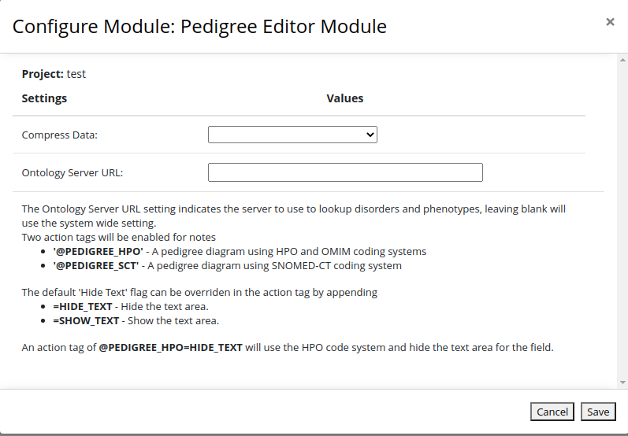
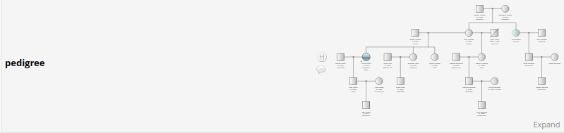

# Pedigree Editor External Module

The pedigree editor external module allows a notes field to be marked with an anotation to indicate the field will represent a pedigree diagram.

The module will then hide or disable the notes field and instead spawn a new window to allow the entry of the pedigree diagram. The diagram will then be serialised as a FHIR Composition JSON string and written into the notes field. 
The pedigree editor used is [https://github.com/aehrc/open-pedigree](https://github.com/aehrc/open-pedigree) which is an open version of the phenotips pedigree editor.
The plugin also makes use of [pako](https://github.com/nodeca/pako) a javascript implementation of the Zlib library.

## Installing the module

To install first you need to retrieve the distribution. This can be found on the releases page [https://github.com/aehrc/redcap_pedigree_editor/releases](https://github.com/aehrc/redcap_pedigree_editor/releases) page or 
the official redcap repository [https://redcap.vanderbilt.edu/consortium/modules/](https://redcap.vanderbilt.edu/consortium/modules/)

Alternatively you can clone the git repository and generate your own distribution file. To do this, clone the git repository into a working directory, then use the git archive command to build a release.
```
git clone https://github.com/aehrc/redcap_pedigree_editor.git
cd redcap_pedigree_editor
git archive --format=zip  --prefix=redcap_pedigree_editor_v0.2/ -o ../redcap_pedigree_editor_v0.2.zip HEAD
```

This will give you a file redcap_pedigree_editor_v0.2.zip

## Changes
- v0.1 - Initial Release 
- v0.1.1 - Allow use inside a survey
- v0.2 - Upgrade open-pedigree version to allow use of the svg image encoded in the pedigree data to show real 
representation of the diagram, add compression for large diagrams.

# Install the distribution

The distribution is installed by unzipping the distribution file into the `redcap/modules/` directory of the redcap installation.

This should result in the new directory `'redcap_pedigree_editor_v0.1.1'`. The external module directory name must meet a strict naming
convention, if the directory is missing the `'v'` before the version number then the module won't be picked up by redcap, so rename
the directory to match the form `'<module name>_v<version number>'`.

If everything has gone to plan the module should now appear in the list of available modules that can be enabled.

## Configuring the module

Once installed the module has a number of system wide options:

 - *Hide Text* - Flag to indicate if the text area associated with the note should be shown. The format used to store 
   diagram will likely not make sense to anyone so this option should probably set to true.
 - *Compress Data* - Specifies how to deal with large diagrams. The fhir format returned from the open_pedigree editor 
   will now have a new section called 'Pedigree Diagram' which will contain a DocumentReference which will have an SVG 
   representation of the pedigree diagram. This diagram will be used by the redcap plugin to show the pedigree diagram. 
   Because there are size limitations for the text in the redcap database associated with the pedigree field the 
   addition of the 'Pedigree Diagram' section can quite easilly exceed the limit. The 'Compress Data' options tells the
   system how to deal with the returned text exceeding 64K. The options are:
   - *Never Compress* - (this is the default) Compression is not used. If the data exceeds 65K characters the diagram will
     be stripped from the result and any future views of the diagram inside redcap will instead show a placeholder image.
   - *Compress Large Diagrams >65K* - The data is compressed if its over 65K. If its still too large after being 
     compressed, the diagram is stripped and the if its greater than 65K its compressed.
   - *Always Compress* - The data is always compressed. If the compressed data is greater than 65K the diagram is stripped.
 - *Ontology Server URL* - The URL for FHIR ontology server used to lookup disorders, phenotypes and genes. If left blank then the default *'https://genomics.ontoserver.csiro.au/fhir/'* will be used. There is a matching project setting, which allows a project to use a different ontology server.
 


### Project Settings

Each project can override the *Compress Data* and *Ontology Server URL* setting. If left blank then the system setting will be used.



## Creating a Pedigree field
To make use of the editor a field needs to be created in the online designer and marked with one of two action tags. Only fields of type `Notes Box` are considered.
  - *@PEDIGREE_HPO* - Marks a field to be a pedigree editor using the HPO and OMIM coding systems for phenotypes and disorders.
  - *@PEDIGREE_SCT* - Marks a field to be a pedigree editor using the SNOMED-CT coding system for phenotypes and disorders.

The default 'Hide Text' and 'Compress Data' options can be overriden in the action tag by appending '=' plus a comma 
separated list of options.
  - *HIDE_TEXT* - Hide the text area.
  - *SHOW_TEXT* - Show the text area.
  - *NEVER_COMPRESS* - Never compress the data stored in this field.
  - *COMPRESS_LARGE* - Compress the data if it exceeds 65K characters.
  - *ALWAYS_COMPRESS* - Always compress the data for this field.

An action tag of @PEDIGREE_HPO=HIDE_TEXT,NEVER_COMPRESS will use the HPO code system and hide the text area for the 
field and prevent compression of the data stored in the field.


## Data Entry

In the data entry page, a notes field marked with the pedigree editor action tag will show a large image, if this is clicked 
a new window will open and allow the pedigree diagram to be editted. 
An empty field will appear as the words 'Create Diagram' with a single diamond.
A field for which a diagram has been added will show the image for the diagram extracted from the data returned from the 
editor. If this has been stripped for some reason instead a placeholder image is shown.
 




If the pedigree data does not contain an image a placeholder image is shown.


# Limitations

This module uses a FHIR based representation of the pedigree diagram. Unfortunately the specification is still being
developed, so it is still not possible to map all of the data captured by the pedigree editor. This means that any 
data with no mapping will be lost. Some other aspects of the mapping also do not translate directly, where possible
naming conventions are used to try and account for these. For example the FHIR FamilyHistory resource has a single
name field which is a string. The pedigree editor has a first name, last name and a last name at birth, this will
be written into the FamilyHistory resource as <first name> <last name> (<last name at birth>). When importing the FHIR
resource everything but the last word is the first name a trailing '(name)' will be taken as last name at birth.

Heredity options - This can be 'Childless' or 'Infertile' in the editor, but is not currently stored on the fhir resource.
Carrier Status - This can be 'Carrier' or 'Pre-symptomatic' in the editor, but is not currently stored on the fhir resource.
Evaluated - This is a checkbox in the editor, but is not currently stored on the fhir resource.
Lost Contact - This is a checkbox in the editor, but is not currently stored on the fhir resource. 
Multiple Sibling Nodes - In the editor you can create a single node to represent multiple siblings, at the moment these
will be saved as a single familiy history resource with no name and the number of siblings will be lost.

Phenotype and Candidate Genes are both stored as Observation Resources associated with a family history resource. The
system uses a naming convention to distinguish the two, otherwise it tries to match the code system to try and determine
if the observation represents a Phenotype or Candidate gene.

Life status - This can be 'unborn', 'stillborn' and 'aborted' with an associated gestation age. This will be written into
the deceasedString field on the family history resource in a form like 'stillborn 34 weeks'.

# Large Data Issues
A redcap notes field can store up to 65K of character data. This should be fine if someone was typing a note, but with
adding an svg representation of the pedigree diagram as well as the verbose nature of FHIR a large diagram can hit this
limit. The compress data option will tell the plugin how to handle large data.  
Compressed data will be gzipped, converted to base64 and have 'GZ:' appended to the start of the text.
